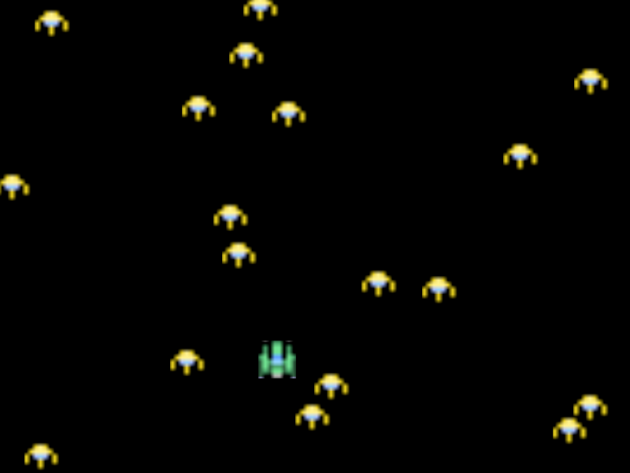

# shotgun

A simple game with [Baryon](https://github.com/kvark/baryon), just to get a feel of how API should be shaped in the engine.

Using Gustavo Vituri's [space shooter](https://gvituri.itch.io/space-shooter) asset pack.

